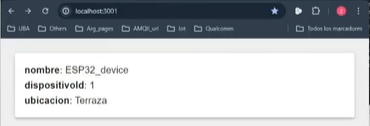
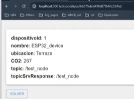

# AirQual-Frontend


## Getting Started

Ejecutar el siguiente comando server:

```bash
npm run dev

obtenemos el siguiente print: 

> 2022-front-react@0.1.0 dev
> next dev

warn  - Port 3000 is in use, trying 3001 instead.
ready - started server on 0.0.0.0:3001, url: http://localhost:3001
wait  - compiling...
event - compiled client and server successfully in 202 ms (168 modules)


en el navegador pegar la siguiente url:

http://localhost:3001





